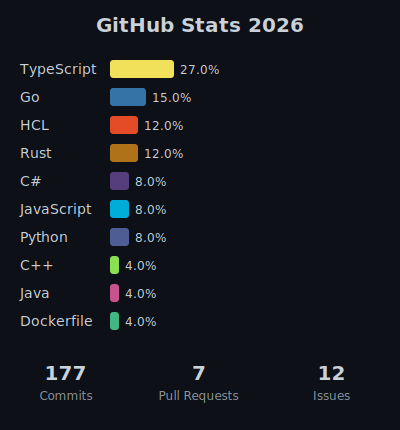

# Github status generator

Generates a dark-themed SVG card showing GitHub language stats and activity (commits, PRs, issues) for the current year, updated automatically each week via GitHub Actions.

## How it works

- `fetch.py` calls the GitHub GraphQL API to collect language usage and activity counts
- Results are written to `stats/data.json`
- `render.py` reads `data.json` and produces `stats/stats.svg`
- The GitHub Action runs both scripts on a schedule and commits the updated SVG

## Setup

1. Fork or clone the repository.
2. Go to Settings → Secrets and variables → Actions and add `GH_TOKEN` (classic PAT with `public_repo` and `read:user` scopes) as a Secret and `GH_USERNAME` (your GitHub username) as a Variable.
3. Enable Actions on the repo if not already enabled.
4. Trigger the workflow manually via Actions → Generate Stats SVG → Run workflow to generate the first SVG.

## Local usage

```bash
export GH_TOKEN=<your-token>
export GH_USERNAME=<your-username>
python stats/fetch.py
python stats/render.py
```

## File overview

| File | Description |
|------|-------------|
| `stats/fetch.py` | Fetches stats from GitHub API |
| `stats/render.py` | Renders stats.svg from data.json |
| `.github/workflows/stats.yml` | Weekly Action that runs both scripts and commits the result |


